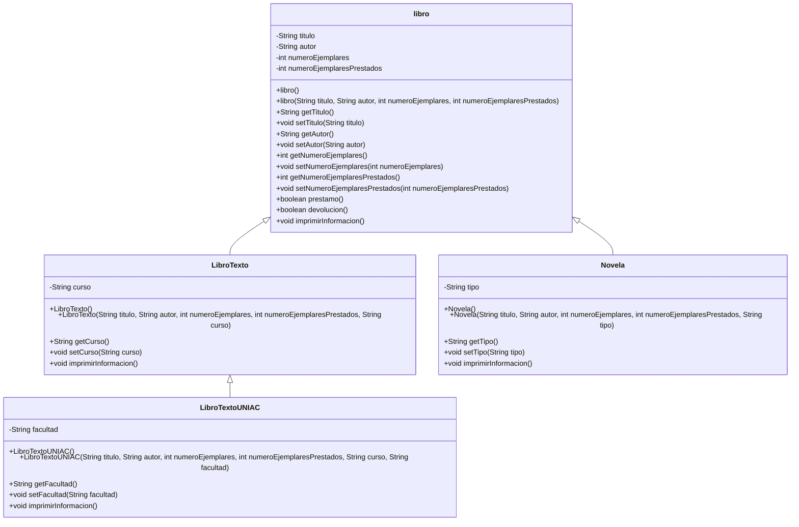

# Integrantes 
### William Villa
### Alejandro Ibarra
### Juan Pablo Rubiano
---

# Diagrama de clase Mermaid

```mermaid
classDiagram
    class libro {
        -String titulo
        -String autor
        -int numeroEjemplares
        -int numeroEjemplaresPrestados
        +libro()
        +libro(String titulo, String autor, int numeroEjemplares, int numeroEjemplaresPrestados)
        +String getTitulo()
        +void setTitulo(String titulo)
        +String getAutor()
        +void setAutor(String autor)
        +int getNumeroEjemplares()
        +void setNumeroEjemplares(int numeroEjemplares)
        +int getNumeroEjemplaresPrestados()
        +void setNumeroEjemplaresPrestados(int numeroEjemplaresPrestados)
        +boolean prestamo()
        +boolean devolucion()
        +void imprimirInformacion()
    }

    class LibroTexto {
        -String curso
        +LibroTexto()
        +LibroTexto(String titulo, String autor, int numeroEjemplares, int numeroEjemplaresPrestados, String curso)
        +String getCurso()
        +void setCurso(String curso)
        +void imprimirInformacion()
    }

    class LibroTextoUNIAC {
        -String facultad
        +LibroTextoUNIAC()
        +LibroTextoUNIAC(String titulo, String autor, int numeroEjemplares, int numeroEjemplaresPrestados, String curso, String facultad)
        +String getFacultad()
        +void setFacultad(String facultad)
        +void imprimirInformacion()
    }

    class Novela {
        -String tipo
        +Novela()
        +Novela(String titulo, String autor, int numeroEjemplares, int numeroEjemplaresPrestados, String tipo)
        +String getTipo()
        +void setTipo(String tipo)
        +void imprimirInformacion()
    }

    libro <|-- LibroTexto
    LibroTexto <|-- LibroTextoUNIAC
    libro <|-- Novela
```
    
